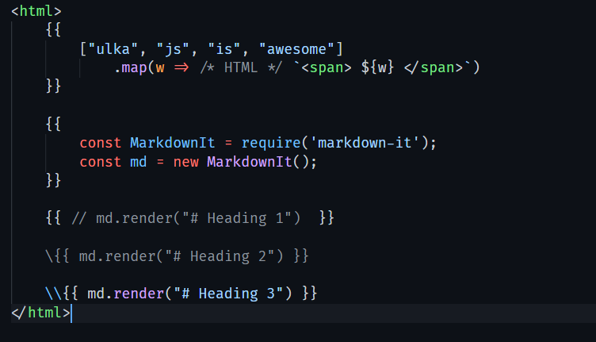

    

<h2 align="center">Ulka Language Support</h2>

Syntax highlight for <code>.ulka</code> files.

## Features

- Highlight html in `.ulka` files.
- Highlight js inside ulka block.
- Highlight html inside template literals.

## Screenshot

