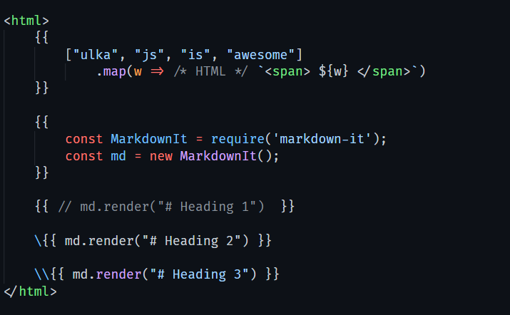

<p align="center">
    
</p>

<h2 align="center">Vscode Ulka</h2>

<p align="center">Syntax highlighter and Formatter for <code>.ulka</code> files.</p>

## Features

- Highlight html in `.ulka` files.
- Highlight js inside ulka block.
- Highlight html inside template literals.
- Highlight frontmatter yaml.
- Format html and ulka block.

## Settings

- Add emmet support

  ```json
  {
    "emmet.includeLanguages": {
      "ulka": "html"
    }
  }
  ```

- Icon
  - material-icon-theme
    ```json
    {
      "material-icon-theme.files.associations": {
        "*.ulka": "html"
      }
    }
    ```
  - vscode-icons
    ```json
    {
      "vsicons.associations.files": [
        { "icon": "html", "extensions": ["ulka"], "format": "svg" }
      ]
    }
    ```

## Screenshot


